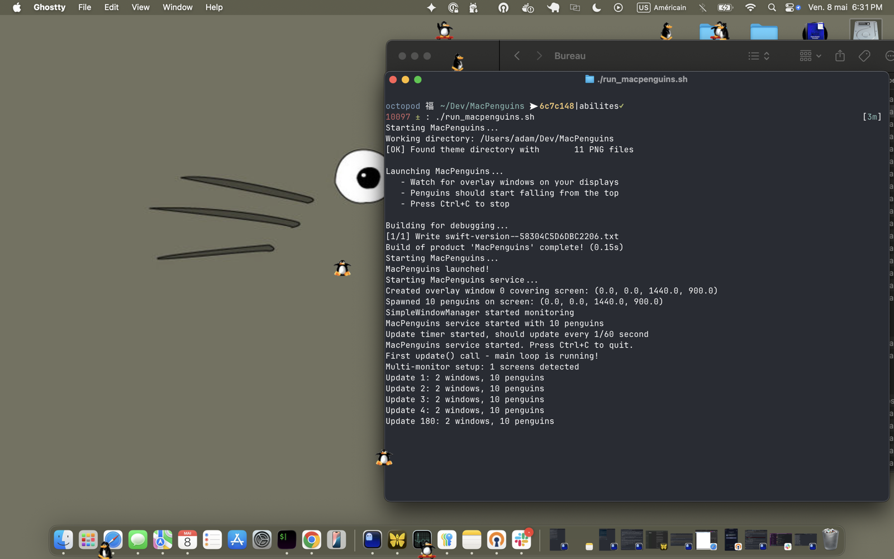

# MacPenguins — Penguins for Mac

[](LICENSE)  

A macOS port of the classic [XPenguins](http://xpenguins.seul.org/)
desktop toy. Cartoon penguins fall from the top of your screen, walk
along the tops of windows, and shuffle around at the bottom of your
display in front of the Dock.



> **Status:** early port. Walking, falling, tumbling, and a reading
> idle action work; a skateboarder variant zips around faster. Several
> of the original states (climbing, floating, dying) are not yet
> implemented — see [Roadmap](#roadmap).

## Requirements

- **Requires:** macOS 13 (Ventura) or later — enforced as the SwiftPM
  deployment target in `Package.swift`.
- **Tested on:** macOS 15.7.2 (Sequoia), Apple Silicon. Older versions
  should work API-wise (we use only long-stable AppKit / CGWindow
  calls) but haven't been verified — reports welcome.
- Swift toolchain (Xcode or `xcode-select --install`).

## Run

```bash
git clone https://github.com/MonkeyIsNull/MacPenguins
cd MacPenguins
./run_macpenguins.sh
```

The script just runs `swift run MacPenguins`. The first run will
build (~1–2 seconds on Apple Silicon); subsequent runs are instant.

Hit `Ctrl+C` in the terminal to stop. There is no dock icon — it runs
as a background service drawing into a transparent overlay window
above the Dock.

## What works

- Penguins fall from the top of the screen and walk along the bottom
- Penguins land on the top edge of any open window and walk along it
- Penguins ride windows as you resize them, and fall off if you shrink
  a window past their feet or close it
- Tumbling: walking off a window's edge produces a cartwheel arc with
  the penguin's horizontal momentum carried into the fall
- Idle reading: normal penguins occasionally pause to read a book
- Multi-monitor (the screen-bottom ground is per-screen)
- A skateboarder variant (~3/8 of penguins) walks faster

## What's missing

These exist in the original XPenguins but aren't implemented yet:

- Climbers (scaling window sides / screen edges)
- Floaters (balloon-style upward drift)
- Death animations: explosion, splatted, squashed, zapped
- Angel ascent before respawn
- Digger idle action (skateboarder counterpart to the reader)
- Click-to-zap interaction
- Side-mounted Dock awareness

## Project layout

```
Sources/                 Swift sources (build target)
  main.swift             Entry point
  MacPenguinsService     Update loop, spawning, lifecycle
  SimplePenguin          Per-penguin physics + state machine
  SimpleCollision        Window + ground surface tracking
  SimpleWindowManager    CGWindow polling
  BasicRenderer          NSWindow overlay + sprite rendering
sprites/                 Pre-split walker frames + faller/tumbler
MacPenguins/Themes/      Original-style sprite sheets (incl. skateboarder)
```

The repo also has an `MacPenguins.xcodeproj/` for opening in Xcode if
you prefer; the SwiftPM `Package.swift` is the canonical build target.

## Roadmap

Rough order of attack for the remaining pieces:

1. Climbers — when a walker hits a vertical obstacle, scale the window's side
2. Death animations + angel respawn cycle (explosion / splatted / squashed / zapped → angel → faller)
3. Floaters (balloon-style upward drift, used after head-bumping)
4. Digger idle action (skateboarder pauses to dig — counterpart to the reader)
5. Click-to-zap interaction
6. Side-Dock and notch handling

Done so far: tumblers (walking off a window edge), reader idle action,
and the skateboarder variant.

## Contributing

PRs welcome — bug fixes, items off the [roadmap](#roadmap), new themes,
or sprite improvements. Match the existing code style, keep changes
focused, and verify visibly that your change works. No tests required;
this is a desktop toy.

By submitting a PR you agree your contribution ships under GPL v2,
matching the rest of the project.

Bug reports: please include your macOS version and a short repro.

New themes or sprites go under `MacPenguins/Themes/<ThemeName>/` —
please credit any artwork you didn't draw yourself.

## Credits

This is a port of Robin Hogan's **XPenguins** (1999–2001). All sprite
artwork is his, used under GPL v2. See [`CREDITS.md`](CREDITS.md) for
full attribution.

## License

GNU General Public License v2 — see [`LICENSE`](LICENSE).

This port is GPL v2 because the sprite assets are derivatives of
Robin Hogan's GPL v2 XPenguins artwork. The Swift code in `Sources/`
is original work and is also released under GPL v2 to keep the whole
package consistently licensed.
